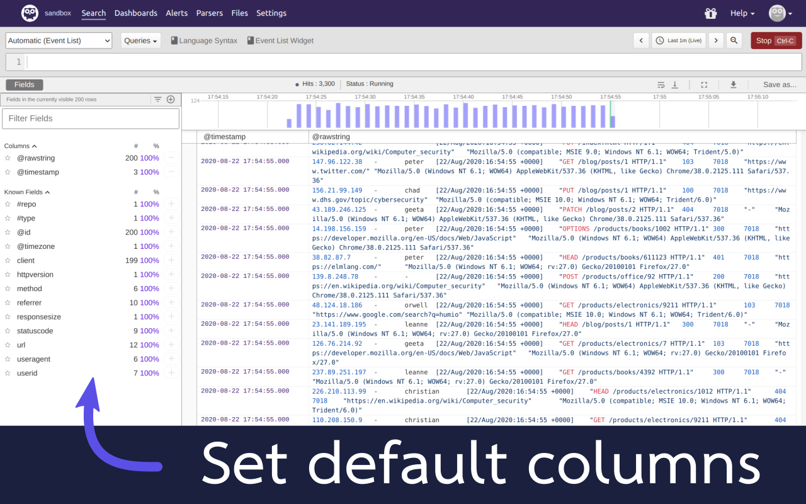

# 🦉 Humio Column Setter Extension [(install here)](https://chrome.google.com/webstore/detail/humio-column-setter/okndmhfieknknniookjdpckldpomakna)

Browser extension to set Humio fields/columns on queries to a customizable preset list.

Found a bug, or have an idea for an improvement? [Raise an issue](https://github.com/domdomegg/humio-column-setter/issues).

## 🙌 Contributing

Contributions are welcomed! To install locally:

1. Clone this repository
2. Go to `chrome://extensions`
3. Enable `Developer mode` in the top right
4. Click `Load unpacked`, and select the cloned folder
